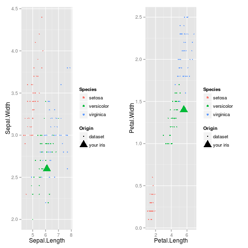

Which iris you have?
========================================================
author: Margarette Kulikova
date: 21.09.2014

Determining iris
========================================================

Given you have an iris and you don't know its specie. How to find it?

Now it is possible to find out your iris specie with my application "Which iris you have?":

https://martaritana.shinyapps.io/DevelopingDataProducts_CP/

How does it work?
========================================================

The application uses a model fitted on R iris dataset. The model is fitted using Recursive Partitioning and Regression Trees with help of caret package.


```r
library(caret)
data(iris)
modelFit <- train(Species ~ ., data=iris, method="rpart")
```

Final model
========================================================


```r
modelFit$finalModel
```

```
n= 150 

node), split, n, loss, yval, (yprob)
      * denotes terminal node

1) root 150 100 setosa (0.33333 0.33333 0.33333)  
  2) Petal.Length< 2.45 50   0 setosa (1.00000 0.00000 0.00000) *
  3) Petal.Length>=2.45 100  50 versicolor (0.00000 0.50000 0.50000)  
    6) Petal.Width< 1.75 54   5 versicolor (0.00000 0.90741 0.09259) *
    7) Petal.Width>=1.75 46   1 virginica (0.00000 0.02174 0.97826) *
```

Your result is plotted on exsisting dataset
========================================================

 
